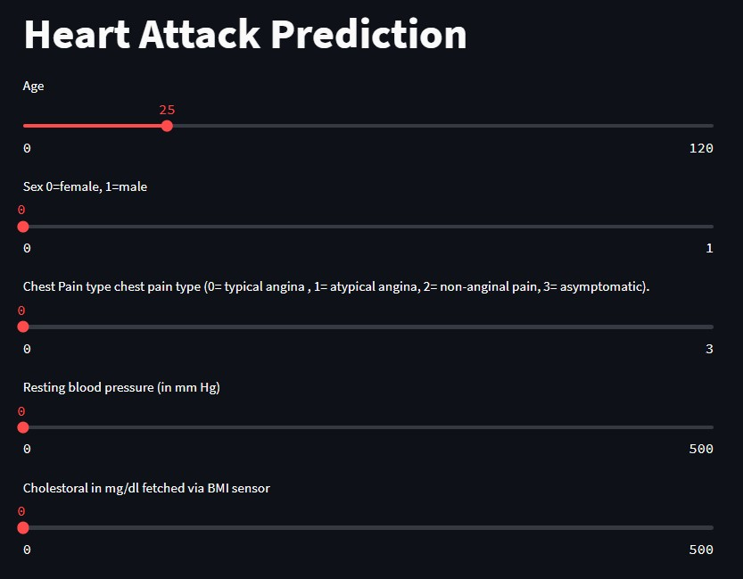

# Heart-Attack-Prediction

## Description
A machine learning model to detect the likelihood of having a heart attack. 

## Getting Started

### Dependencies

* numpy, pandas, matplotlib, seaborn.
* streamlit 

### Data

* https://www.kaggle.com/datasets/rashikrahmanpritom/heart-attack-analysis-prediction-dataset

## Results 

### Accuracy 
Accuracy achieved is <95% using Bernoulli Naive Bayes
